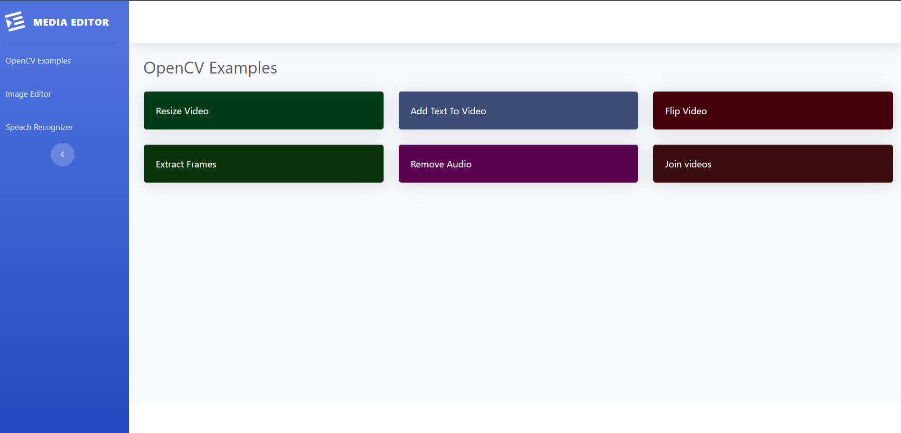
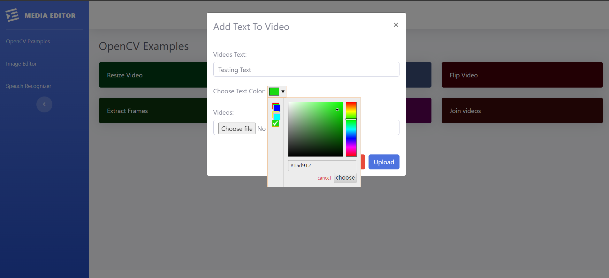
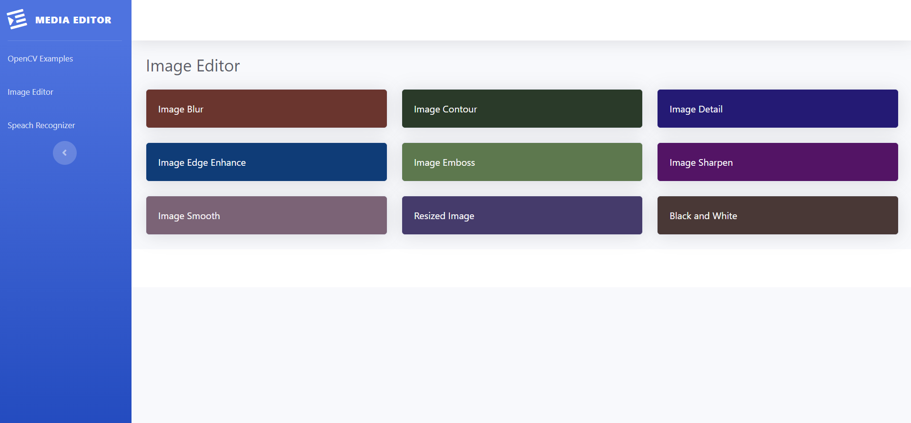
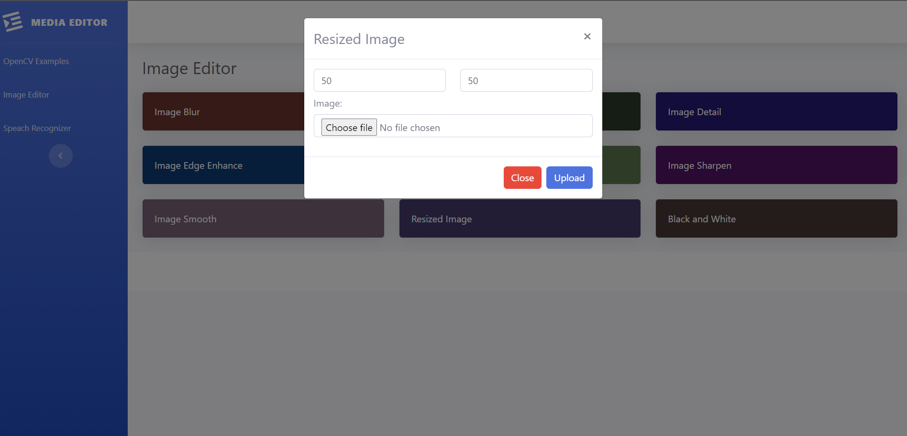
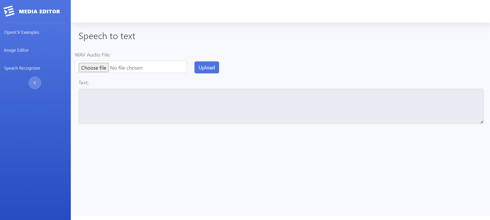

# Project Name

Brief description of your project.

## Table of Contents
- [Getting Started](#getting-started)
- [Usage](#usage)
- [JavaScript Packages](#javascript-packages)
- [Python Packages](#python-packages)

## Getting Started

Media editor is a flask based project which contains alot of options to edit (videos , images ) and also can convert audio in to text

## Usage

1. **OpenCV Example**
    
    

    - This webpage offers a variety of video editing options, including resizing, adding text, flipping, extracting frames, removing audio, and joining videos.
    - Upon clicking any button on the page, a Bootstrap modal will appear, presenting video upload options specific to the selected action. After inputting the necessary information, it will take some time to upload and process the video. Once processing is complete, a download button will be provided for the edited video.
    - As this part of the project is supposed to use opencv so it does not take care of the audio of the videos

2. **Image Editor**
    
    
    -This webpage offers a variety of image editing options, including resizing, blue, contour, image detail,image sharpen, smooth and Black and white
    - Upon clicking any button on the page, a Bootstrap modal will appear, presenting image upload options specific to the selected action. After inputting the necessary information, it will take some time to upload and process the image. Once processing is complete, a download button will appear beneath the image view.

3. **Speach Recognizer**

    
    
    -This webpage contains a choose file option (.wav file format)
    - Upon clicking on upload button it will take some time to upload and process the the audio. Once processing is complete it will populate the text in to the Text(textarea)

## JavaScript Packages

These are the packages used for frontend 

1. **Jquery**
    jQuery is a lightweight JavaScript library that simplifies DOM manipulation, event handling, and Ajax requests, making it ideal for enhancing web interactivity.

2. **Axios**
    Axios is a promise-based HTTP client for making HTTP requests in JavaScript, known for its simplicity and cross-browser compatibility, making it a great choice for handling API calls.

## Python Packages

This section lists the Python packages/modules used in your project. Provide a brief description of each and include links to their documentation or PyPI (Python Package Index) pages.

1. **Flask**
   -  Flask is a lightweight Python web framework that simplifies the process of building web applications. It provides tools for routing, handling HTTP requests, and creating web templates
   - [Installation] (pip install Flask)

2. **OpenCV Python**
   - Description: OpenCV-Python (Open Source Computer Vision Library) is a computer vision library that provides tools and functions for image and video analysis, including object detection, image processing, and more.
   - [Installation] (pip install opencv-python)

3. **SpeechRecognition**
   - SpeechRecognition is a Python library for converting speech to text, supporting various speech recognition engines and audio sources.
   - [Installation] (pip install opencv-python)

